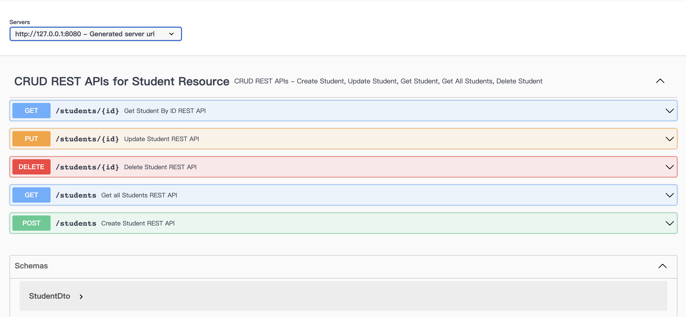

# Introduction
This repository provides a Spring Boot project that implements CRUD operations for a student entity and includes a many-to-many relationship between students and teachers. It also demonstrates the usage of logging, exception handling, interfaces, and DTO objects for response.

# Project Structure
The project is structured as follows:

- controller: Contains the REST API controllers
- service: Service classes for business logic
- repository: Spring Data repositories for database operations
- entity: Entity classes for student and teacher
- dto: Data Transfer Objects (DTOs) for response objects
- exception: Custom exception classes

# API
The following API endpoints are available:

- To retrieve all students: GET request - http://localhost:8080/students
- To retrieve a specific student: GET request - http://localhost:8080/students/{id}
- To create a student: POST request - http://localhost:8080/students
- To update a student: PUT request - http://localhost:8080/students/{id}
- To delete a student: DELETE request - http://localhost:8080/students/{id}

Access the Swagger UI documentation by visiting http://localhost:8080/swagger-ui/index.html in web browser. 
This documentation provides detailed information about the available endpoints, request/response structures, and allows to interact with the API.

